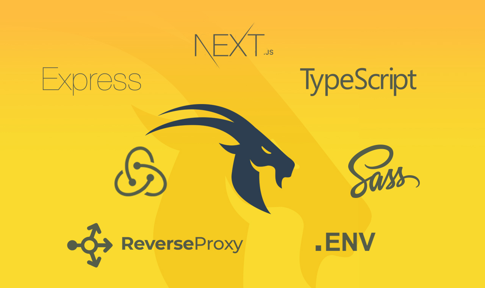

<br/>
<div align="center" >Performance oriented Next.js application boilerplate with Redux, Typescript, Express.js and Sass.</div>
<br/>

<div align="center">
  <!-- CodeClimate -->
  <a href="https://codeclimate.com/github/pankod/next-boilerplate/maintainability">
    
  </a>
  <!-- TestCoverage -->
  <a href="https://codeclimate.com/github/pankod/next-boilerplate/test_coverage"></a>
  <!-- Build Status -->
  <a href="https://travis-ci.org/pankod/next-boilerplate">
    
  </a>
  <!-- Dependency Status -->
  <a href="https://david-dm.org/pankod/next-boilerplate">
    
  </a>
  <!-- devDependency Status -->
  <a href="https://david-dm.org/pankod/next-boilerplate#info=devDependencies">
    
  </a>
</div>


<br/>
<div align="center">
  <sub>Created by <a href="https://www.pankod.com">Pankod</a></sub>
</div>


## About


Next.js is a minimalistic React framework that runs on the browser and the server. It offers developers an easy way to get started, and as it uses React.js for templating, it's also a straightforward way for developers with React experience to get productive quickly.

The advantage of this approach is to be able to create rich user experiences in a uniform way, without compromising SEO (Search Engine Optimisation) factors that are key to good ranking on Google and other search engines.

This boilerplate makes it easier to get up and running with a well-structured Next.js and TypeScript application.

<br/>

## Features


next-boilerplate project provides a lot of features out of the box. Here's an overview of the included components and tools.

* **Next.js** - Minimalistic framework for server-rendered React applications.
* **Typescript** - Superset of JavaScript which primarily provides optional static typing, classes and interfaces.
* **Redux** - A predictable state container for JavaScript apps.
* **Express.js**- A minimal and flexible Node.js web application framework that handles server-side rendering and integrates with Next.js.
* **Built-in Project CLI**- Create pages, components, actions, reducers with one command by using built-in cli.
* **Sass/Scss** - CSS preprocessor, which adds special features such as variables, nested rules and mixins (sometimes referred to as syntactic sugar) into regular CSS.
* **Docker** - A tool designed to make it easier to create, deploy, and run applications by using containers.
* **Babel** -  The compiler for next generation JavaScript.
* **ESLint** - The pluggable linting utility.
* **Reverse Proxy** - Lightweight server for proxying API requests.
* **Bundler Analyzer** - Visualize the size of webpack output files with an interactive zoomable treemap.
* **Jest** - Javascript testing framework , created by developers who created React.
* **React Testing Library** - Simple and complete React DOM testing utilities that encourage good testing practices.
* **next-runtime-dotenv** - Expose environment variables to the runtime config of Next.js
* **next-i18next** - An internationalization-framework which provides a function that takes a key, some options, and returns the value for the current language. Helps you to add language translation support to your app.
* **Storybook** - An open source tool for developing UI components in isolation for React.
* **Bootstrap** - The most popular HTML, CSS, and JavaScript framework for developing responsive, mobile-first websites.
<br/>


## Setup & Documentation

Please refer to our [setup guide](https://pankod.github.io/next-boilerplate/docs/setup) to create a new app.


For more detailed documentation, check out https://pankod.github.io/next-boilerplate/

<br/>

## Built-in CLI


<div>
 
</div>
<br/>
<br/>

Pankod boilerplate is shipped with a CLI tool to streamline the creation of new components. By using the CLI tool, you may easily add pages, class components or functional components to your project and have all the required actions, reducers and imports are automatically created for you.
<br />

To start the CLI, you may have to install it beforehand if you haven't yet.

```
~ $ npm i -g @pankod/pankod-cli
```

Then you can use it in your projects:
```
~ $ npm run cli
```

After starting, an interactive menu will let you configure the component to be created. Firstly, you'll be asked for the type of the component whether it's a page or a functional component. Then you'll be prompted with the other options relevant to your selection.

Eventually, you'll end up with a page or component with style and test files in no time.

<br/>


## License

Licensed under the MIT License, Copyright © 2018-present Pankod
