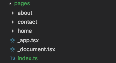

Next.js sahip oldugu özellikten dolayı pages folder ına koyulan dosya isimlerine göre otomatil routing yapabilir.
<br>

<div>
  
</div>
<br>
Yukarıdaki dosya structureana göre dosya isimleri route olmus olur

```
pages/index -> /

pages/about -> /about

pages/home  -> /home
```

Özel url isim tanımlamak için app/routes içine istediğiniz isimle tanımlayabilirsiniz.
