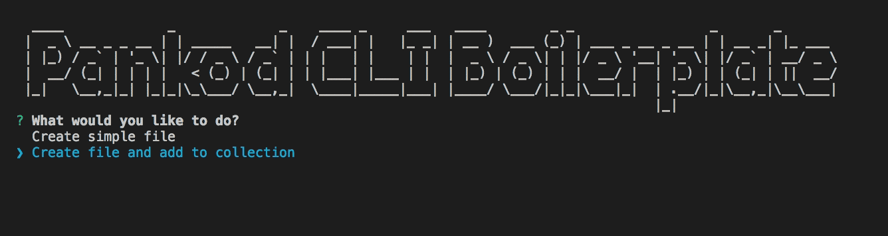

<div align="center">
 
</div>
<br/>
<br/>

<div align="center">
CLI boilerplate for create  project file and content with predefined templates for all type of file extensions.

</div>
<br/>

<div align="center">
  <!-- CodeCov -->
  <a href="https://codecov.io/gh/pankod/cli-boilerplate">
    
  </a>
  <!-- Build Status -->
  <a href="https://travis-ci.org/pankod/cli-boilerplate">
    
  </a>
  <!-- Dependency Status -->
  <a href="https://david-dm.org/pankod/cli-boilerplate">
    
  </a>
  <!-- devDependency Status -->
  <a href="https://david-dm.org/pankod/cli-boilerplate#info=devDependencies"> 
    
  </a>
</div>

<br/>
<div align="center">
  <sub>Created by <a href="https://www.pankod.com">Pankod</a></sub>
</div>
<br/>

<br/>

## About

 By using the CLI tool, you may easily: 

   - Create new files and folders with any file extension,
   
  -  Add predefined content to newly created file by using built-in mustache templating engine.

  - Append new line of content on the desired position to existing file by using regex algorithms.

<br/>

## Getting Started


Run the following method:


```sh
npm install
```
<br/>
Once the installation is done, you should run the following command for compile Typescript:

 ```
 npm run build
 ```

 It saves javascript files to dist folder.

<br/>
Run the following command for compile typescript code anytime you made changes in code:

 ```
 npm run watch
 ```
<br/>
 Once the installation is done, you can run the following command to start CLI.

 ```
 npm run start
 ```

<br/>


#### To customize helper-cli-boilerplate according to the needs of your project:

- Add a new mustache template to templates folder and define file path to methods in helper.ts.

    More info about [mustache.js](https://github.com/janl/mustache.js)

- Define file path into config.ts

- You should define new regex keys in order to catch existing content and append new content to spesicific position in the file which is already exist.


<br/>

#### Outline of some logics behind the methods:

- To create new file:

Set file name -> Send properties to template method -> Define file path -> Generate string content from template -> Send the string content to fs module method -> Create new file with predefined content.

- To append content to existing file:

 Set regex key for catch spesific position in the file content.
    -> Send properties to template method -> Generate string content from template
      -> Send the string content to fs module method -> Append content to existing file.


